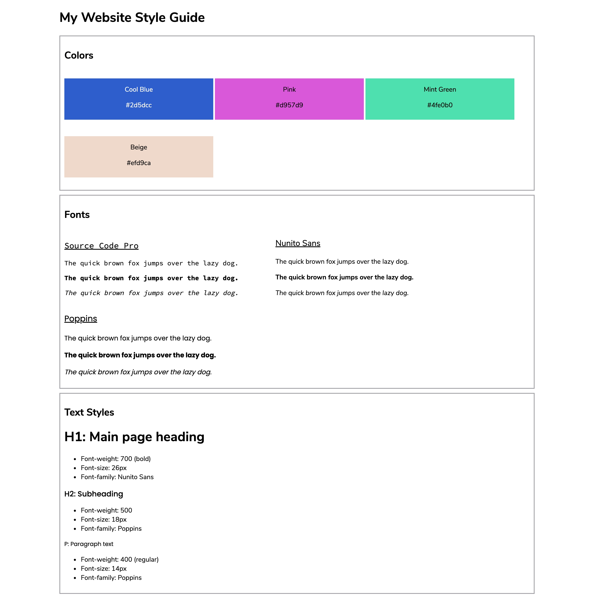

_IMPROVED STYLING WITH CSS_

# Build a Website Design System

## Overview

This project is slightly different than others you have encountered thus far on Codecademy. Instead of a step-by-step tutorial, this project contains a series of open-ended requirements which describe the project you’ll be building. There are many possible ways to correctly fulfill all of these requirements, and you should expect to use the internet, Codecademy, and other resources when you encounter a problem that you cannot easily solve.

## Project Goals

In this project, you’ll be building your own basic design system for a website. In essence, you’ll be building a website to help you build MORE websites in the future! On your site, you’ll collect all the colors, fonts, and some of the repeating styles.

## Project Requirements

In this project, you’ll build a style guide/design system for your website. Developers and designers use design systems in order to organize the look and feel of a website or web application. Design systems help to document the visual vocabulary and reusable components of a large website.

As your websites grow larger and more complex, having a consistent set of styles will help them stay cohesive and enjoyable for users! It also helps as you start working with other developers, as you can have a consistent reference for how your website should be built.

Your style guide/design system will include at least a section on colors, fonts, and specific text styles, but it can be extended to as many other areas as you’d like. You can take a look at our [basic example](https://content.codecademy.com/PRO/independent-practice-projects/website-design-system/example/index.html) site for a taste of what you’ll be building (yours will be customized).

**Example**

